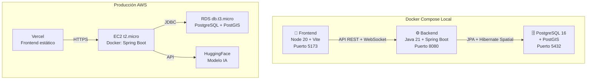

# 🐳 Plan de Dockerización y Despliegue

## Docker Compose (Dev) + AWS (Prod)

---

## Arquitectura de Contenedores



---

## 1. Estructura de archivos Docker

```
Incendios_Fullstack/
├── docker-compose.yml
├── docker-compose.prod.yml
├── .env                          # Variables de entorno
├── back/
│   ├── Dockerfile                # Multi-stage: Maven build + JRE
│   ├── .dockerignore
│   ├── pom.xml
│   └── src/...
├── front/vite-project/
│   ├── Dockerfile                # Dev (Vite dev server)
│   ├── Dockerfile.prod           # Prod (Nginx)
│   ├── nginx.conf
│   ├── .dockerignore
│   └── src/...
└── db/
    └── init/
        ├── 01_extensions.sql
        ├── 02_types.sql
        ├── 03_tables.sql
        ├── 04_triggers.sql
        ├── 05_views.sql
        └── 06_seeds.sql
```

---

## 2. docker-compose.yml (Desarrollo)

```yaml
version: '3.9'

services:
  # ============================================
  # BASE DE DATOS — PostgreSQL + PostGIS
  # ============================================
  db:
    image: postgis/postgis:16-3.4
    container_name: incendios_db
    restart: unless-stopped
    environment:
      POSTGRES_DB: incendios_db
      POSTGRES_USER: postgres
      POSTGRES_PASSWORD: ${DB_PASSWORD:-postgres_dev_123}
    ports:
      - "5432:5432"
    volumes:
      - pgdata:/var/lib/postgresql/data
      - ./db/init:/docker-entrypoint-initdb.d
    healthcheck:
      test: ["CMD-SHELL", "pg_isready -U postgres -d incendios_db"]
      interval: 10s
      timeout: 5s
      retries: 5

  # ============================================
  # BACKEND — Java 21 + Spring Boot
  # ============================================
  backend:
    build:
      context: ./back
      dockerfile: Dockerfile
    container_name: incendios_backend
    restart: unless-stopped
    environment:
      SPRING_PROFILES_ACTIVE: dev
      DATABASE_URL: jdbc:postgresql://db:5432/incendios_db
      DB_USER: postgres
      DB_PASSWORD: ${DB_PASSWORD:-postgres_dev_123}
      JWT_SECRET: ${JWT_SECRET:-dev_jwt_secret_change_in_prod}
      FRONTEND_URL: http://localhost:5173
      HF_SPACE_URL: ${HF_SPACE_URL}
    ports:
      - "8080:8080"
    volumes:
      - ./back/uploads:/app/uploads
    depends_on:
      db:
        condition: service_healthy

  # ============================================
  # FRONTEND — React + Vite (dev server)
  # ============================================
  frontend:
    build:
      context: ./front/vite-project
      dockerfile: Dockerfile
    container_name: incendios_frontend
    restart: unless-stopped
    environment:
      VITE_API_URL: http://localhost:8080
    ports:
      - "5173:5173"
    volumes:
      - ./front/vite-project/src:/app/src
      - ./front/vite-project/index.html:/app/index.html
    depends_on:
      - backend

volumes:
  pgdata:
    driver: local
```

---

## 3. Dockerfiles

### 3.1 Backend — Spring Boot (Multi-stage)

```dockerfile
# back/Dockerfile
# ---- Stage 1: Build con Maven ----
FROM maven:3.9-eclipse-temurin-21 AS builder
WORKDIR /build
COPY pom.xml .
# Descargar dependencias primero (cache Docker)
RUN mvn dependency:go-offline -B
COPY src ./src
RUN mvn package -DskipTests -B

# ---- Stage 2: Runtime con JRE ----
FROM eclipse-temurin:21-jre-alpine
WORKDIR /app

# Crear usuario no-root
RUN addgroup -S spring && adduser -S spring -G spring
USER spring:spring

# Copiar JAR
COPY --from=builder /build/target/*.jar app.jar

# Crear directorio uploads
RUN mkdir -p uploads

EXPOSE 8080

ENTRYPOINT ["java", "-jar", "app.jar"]
```

```dockerignore
# back/.dockerignore
target/
.idea/
*.iml
.mvn/wrapper/maven-wrapper.jar
uploads/*
.env
```

### 3.2 Frontend — Dev (Vite)

```dockerfile
# front/vite-project/Dockerfile
FROM node:20-alpine
WORKDIR /app
COPY package.json package-lock.json* ./
RUN npm ci 2>/dev/null || npm install
COPY . .
EXPOSE 5173
CMD ["npx", "vite", "--host", "0.0.0.0"]
```

### 3.3 Frontend — Producción (Nginx)

```dockerfile
# front/vite-project/Dockerfile.prod
FROM node:20-alpine AS builder
WORKDIR /app
COPY package.json package-lock.json* ./
RUN npm ci
COPY . .
RUN npm run build

FROM nginx:alpine
COPY --from=builder /app/dist /usr/share/nginx/html
COPY nginx.conf /etc/nginx/conf.d/default.conf
EXPOSE 80
CMD ["nginx", "-g", "daemon off;"]
```

```nginx
# front/vite-project/nginx.conf
server {
    listen 80;
    root /usr/share/nginx/html;
    index index.html;

    location / {
        try_files $uri $uri/ /index.html;
    }

    location ~* \.(js|css|png|jpg|jpeg|gif|ico|svg|woff2?)$ {
        expires 1y;
        add_header Cache-Control "public, immutable";
    }
}
```

---

## 4. Scripts SQL de inicialización

Los archivos en `db/init/` se ejecutan automáticamente en orden alfabético al crear el contenedor por primera vez:

```sql
-- db/init/01_extensions.sql
CREATE EXTENSION IF NOT EXISTS "uuid-ossp";
CREATE EXTENSION IF NOT EXISTS "postgis";
CREATE EXTENSION IF NOT EXISTS "pg_trgm";
```

> [!TIP]
> Copia los bloques SQL del [plan de base de datos](./01_plan_base_datos.md) en archivos separados dentro de `db/init/`.

---

## 5. Comandos Docker — Uso diario

```bash
# Levantar todo (primera vez)
docker compose up --build

# Background
docker compose up -d

# Ver logs
docker compose logs -f backend
docker compose logs -f db

# Acceder a la BD
docker compose exec db psql -U postgres -d incendios_db

# Reiniciar BD (borrar datos)
docker compose down -v
docker compose up --build

# Rebuild solo backend (después de cambios Java)
docker compose build backend --no-cache
docker compose up backend -d
```

---

## 6. Deploy en Producción (AWS Free Tier)

### 6.1 Servicios y Costos

| Componente | Servicio | Free Tier |
|---|---|---|
| **Frontend** | Vercel | ✅ Gratis permanente |
| **Backend** | EC2 `t2.micro` | 750 hrs/mes, 12 meses |
| **Base de datos** | RDS `db.t3.micro` | 750 hrs/mes, 12 meses |
| **Fotos** | S3 | 5GB, 12 meses |
| **IA** | HuggingFace | ✅ Gratis permanente |
| **Total** | | **$0/mes** |

### 6.2 Deploy Base de Datos (RDS)

1. AWS Console → RDS → Create Database
2. PostgreSQL 16, Free Tier, `db.t3.micro`, 20GB
3. DB name: `incendios_db`
4. Security Group: permitir 5432 desde SG del EC2
5. Conectar con `psql` y ejecutar los 6 scripts SQL

### 6.3 Deploy Backend (EC2)

```bash
# SSH a EC2 t2.micro (Amazon Linux 2023)
ssh -i key.pem ec2-user@tu-ec2-ip

# Instalar Docker
sudo yum update -y
sudo yum install -y docker git
sudo systemctl start docker && sudo systemctl enable docker
sudo usermod -aG docker ec2-user

# Clonar y configurar
git clone https://github.com/tu-user/incendios-fullstack.git
cd incendios-fullstack

# Crear .env producción
cat > .env << 'EOF'
DATABASE_URL=jdbc:postgresql://tu-rds.xxx.rds.amazonaws.com:5432/incendios_db
DB_USER=postgres
DB_PASSWORD=tu_password_seguro
JWT_SECRET=secreto_muy_largo_produccion
FRONTEND_URL=https://tu-app.vercel.app
HF_SPACE_URL=https://usuario-fire-severity.hf.space
EOF

# Build y run
docker build -t incendios-backend ./back
docker run -d \
  --name incendios-backend \
  --env-file .env \
  -p 8080:8080 \
  --restart unless-stopped \
  incendios-backend
```

**Security Group EC2:**

| Puerto | Fuente |
|---|---|
| 22 (SSH) | Tu IP |
| 8080 (API) | 0.0.0.0/0 |

### 6.4 Deploy Frontend (Vercel)

```bash
cd front/vite-project
npx vercel --prod

# Variables en Vercel Dashboard:
# VITE_API_URL = http://tu-ec2-ip:8080
```

---

## 7. CI/CD con GitHub Actions (Opcional)

```yaml
# .github/workflows/deploy.yml
name: Deploy
on:
  push:
    branches: [main]

jobs:
  deploy-backend:
    runs-on: ubuntu-latest
    steps:
      - uses: actions/checkout@v4
      - name: Deploy to EC2
        uses: appleboy/ssh-action@v1
        with:
          host: ${{ secrets.EC2_HOST }}
          username: ec2-user
          key: ${{ secrets.EC2_SSH_KEY }}
          script: |
            cd incendios-fullstack && git pull
            docker build -t incendios-backend ./back
            docker stop incendios-backend || true
            docker rm incendios-backend || true
            docker run -d --name incendios-backend \
              --env-file .env -p 8080:8080 \
              --restart unless-stopped incendios-backend

  deploy-frontend:
    runs-on: ubuntu-latest
    steps:
      - uses: actions/checkout@v4
      - uses: actions/setup-node@v4
        with: { node-version: 20 }
      - run: cd front/vite-project && npm ci && npm run build
      - uses: amondnet/vercel-action@v25
        with:
          vercel-token: ${{ secrets.VERCEL_TOKEN }}
          vercel-org-id: ${{ secrets.VERCEL_ORG_ID }}
          vercel-project-id: ${{ secrets.VERCEL_PROJECT_ID }}
          working-directory: front/vite-project
          vercel-args: '--prod'
```

---

## 8. Checklist

### Docker Local
- [ ] Crear `docker-compose.yml`
- [ ] Crear `back/Dockerfile` (multi-stage Maven + JRE)
- [ ] Crear `front/vite-project/Dockerfile`
- [ ] Crear scripts SQL en `db/init/`
- [ ] Crear `.env` local
- [ ] `docker compose up --build` → verificar los 3 servicios
- [ ] Verificar WebSocket STOMP funciona

### AWS Producción
- [ ] Crear RDS PostgreSQL + ejecutar SQL
- [ ] Crear EC2 t2.micro + instalar Docker
- [ ] Deploy backend con Docker en EC2
- [ ] Deploy frontend en Vercel
- [ ] Configurar Security Groups
- [ ] Verificar conexión end-to-end
